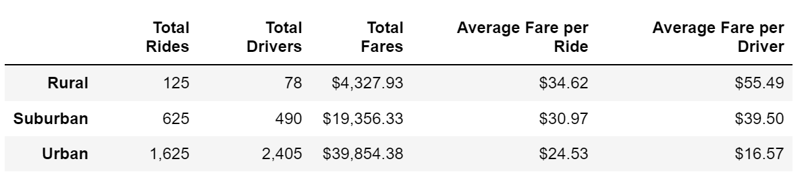
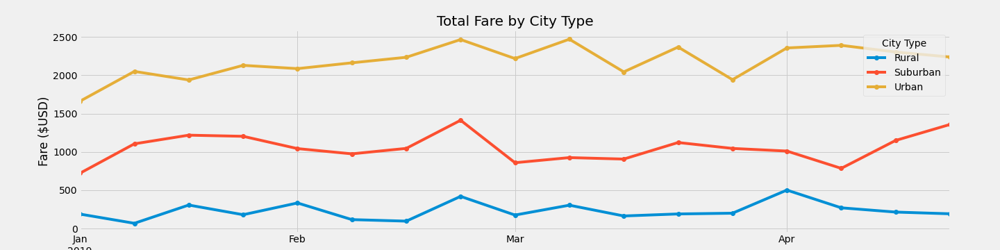

# PyBer_Analysis

# Overview of the analysis

Create a summary of the ride-sharing data by city type. Use Pandas and Matplotlib to show the total weekly fares for each city type.

# Results

- Urban cities have more riders, more drivers, and lower fares per ride and per driver. 
- Volume of total rides is highest in urban cities, lowest in rural cities, and suburban areas are in between the two. Suburban ride totals are closer to rural volumes than urban volumes.
- The averages of fare per ride between the city types are much closer to each other than the averages of fare per driver.

# Summary

- Average fare per driver is wildly divergent between the city types. To bring these proportions closer, either increase the number of drivers in rural and suburban cities, or increase fares in urban cities. Higher volume makes it possible to have lower rates.
- Investigate the populations of the rural and suburban cities, to see if more drivers are available, and more riders may be willing to use the service.
- The number of drivers in urban cities is greater than the number of rides. This is not true for rural and suburban cities. Those city types have more rides than drivers. Re-balance the number of drivers, so there are more rides per driver in the urban cities.